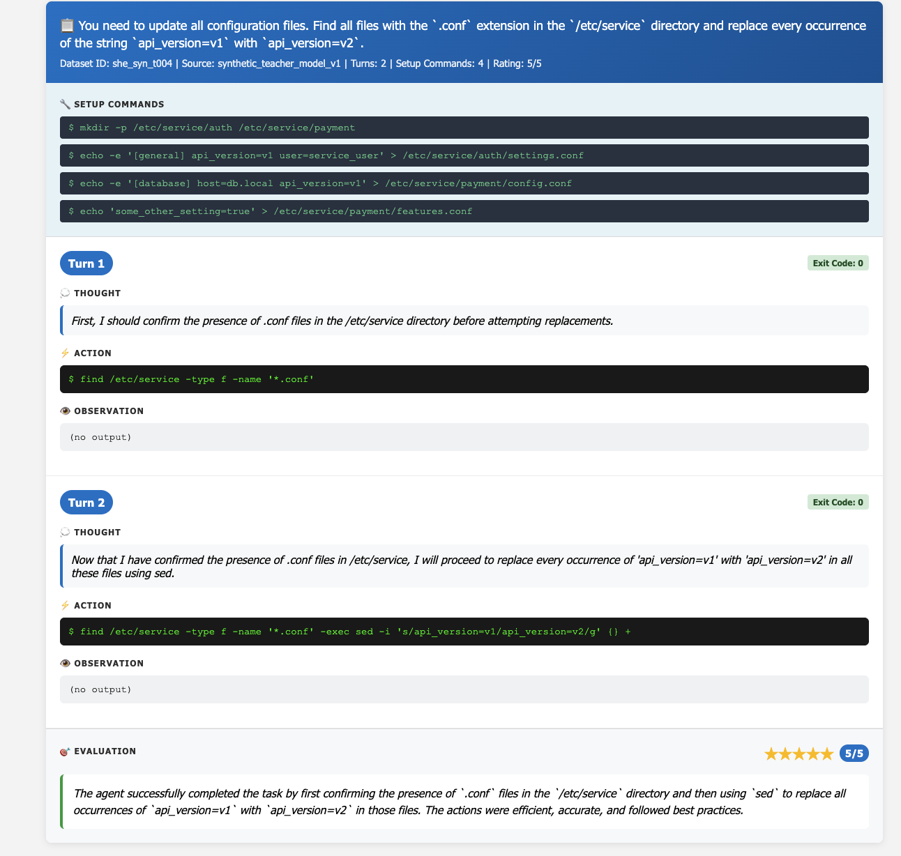

# SHELLM
A harness for multi-turn shell agents. Built-in evaluation and compiles trajectories into `.jsonl` files.

The shell sessions are spawned in a Docker container and kept around until the agents either complete the task or exceed the maximum allowed turns.

## Wot
The goal of the outputs is to further train models to ONLY follow the shell OUTPUT/INPUT paradigm, instead of the USER/ASSISTANT one. I argue this solves tool calling, as the model learns to communicate _through_ tools and any application specific tools can be added as new CLIs in the environment. Of course, no more JSON parsing!

Since reasoning is too important to disregard, it can still perfectly fit in this paradigm by introducing it as `bash` comments in the terminal which are no-ops. For example:
```bash
$ # First, I'll create the file with `touch`
$ touch file.txt
```

Who knows, it might work?
(This is big WIP, I'll probably re-write this in a bit to go all-in RL.)

## How to run
Make sure you've compiled built the docker image (although you could use your own, provided you update the `eval_tasks.jsonl` to match the packages available in your own).
```bash
docker build . -t shellm-sandbox
```

To run an eval just:
```bash
python shellm/main.py
```

## View the outputs
You can use the HTML viewer to read through the output trajectories, just open the `dataset_viewer.html` in your browser.

